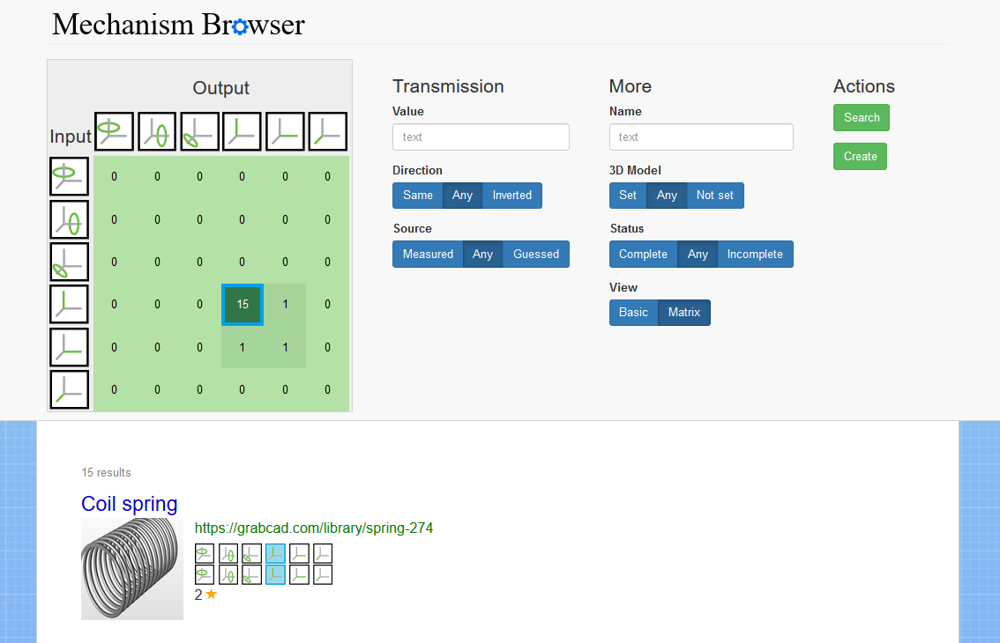

# Mechanism Browser

The mechanism browser allows you to search for mechanisms without knowing their name or a textual description. Instead, you specify mechanical features, like rotation and translation axes, to find what you seek.
Along with the search functionality, you can also add new mechanisms and edit existing articles.


<br></br>
## Requirements
Make sure that you have the following software with the corresponding versions installed:
- Python >= 3.5.3
- Pip >= 10.0.1
- Node >= 8.11.3
- NPM >= 5.6.0

The Mechanism Browser works best with Mozilla Firefox.


<br></br>
## Setup
### Add server to hosts file
For any system that should have access to the Mechanism Browser, add the IP of the server and the hostname "mechanism-browser" to its hosts file.

### Setup the Django server
Make sure that you are using Python 3.

Install the requirements:
```
sudo pip install -r Mechanism-Browser/backend/requirements.txt
```

Navigate to `Mechanism-Browser/backend/mechanismbackend/`.
Migrate the schemas:
```
python manage.py migrate
```

Create a superuser and choose a username and a password:
```
python manage.py createsuperuser
```

Finally, start the Django server:
```
python manage.py runserver 0.0.0.0:8000
```

### Setup the Node.js server
Navigate to `Mechanism-Browser/frontend/`.
Install the dependencies:
```
sudo npm install
```

Then, start the Node.js server:
```
sudo npm start
```


<br></br>
## Usage
### Browse mechanisms
In your browser, open `http://mechanism-browser/`.

### List mechanisms in the backend
In your browser, open `http://mechanism-browser:8000/api/mechanisms`.

### Edit mechanism in the backend
In your browser, open `http://mechainsm-browser:8000/admin`.
At "Mechanisms", click "Add", fill in the form, and confirm.
